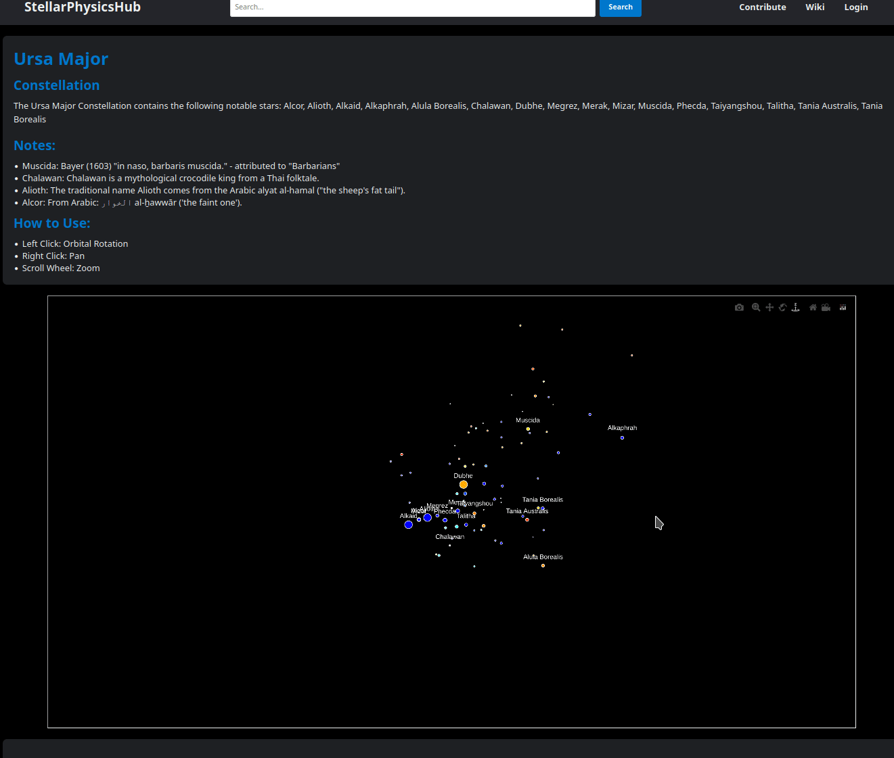

# StellarPhysicsHub

**Disclaimer**: This demo is not updated as frequently as this repository and could be a few commits or many behind.

[StellarPhysicsHub Live Demo](http://wdoyle123.pythonanywhere.com/)



**Note low fps due to being a gif, not the web app**

## Description

StellarPhysicsHub is a Flask-based web application designed for astronomy enthusiasts and researchers. It leverages Flask, a lightweight WSGI web application framework, to provide a user-friendly interface and SQLAlchemy for database interactions. The app offers detailed information about various constellations and asterisms, allowing users to search, view, and interact with celestial bodies.

## Technical Features

- **Flask Framework**: Utilises Flask for backend web app development.
- **SQLAlchemy**: Employs SQLAlchemy as the ORM (Object-Relational Mapping) layer, facilitating database operations like querying, inserting, and updating records.
- **SQLite Database**: Incorporates SQLite, a lightweight database, avoiding the need for a separate server.
- **Search Functionality**: Implements a search feature, allowing users to find constellations and asterisms stored in the SQLite database.
- **User Contributions**: Supports user contributions, enabling enthusiasts to add new data about celestial bodies.
- **Dynamic Content Rendering**: Uses Jinja2 templating for rendering dynamic content fetched from the SQLite database on the frontend.
- **Interactive 3D Visualisations**: Uses [StarScholar3D](https://github.com/WDoyle123/StarScholar3D) for interactive 3D visualisations of the constellations and asterisms.
- **Responsive Design**: Ensures a responsive and accessible web interface.

## Installation

To set up StellarPhysicsHub on your local machine, follow these steps:

1. **Clone the Repository**:
   
    ```bash
    git clone https://github.com/WDoyle123/stellarphysicshub.git
    cd StellarPhysicsHub
    ```

2. **Set Up a Virtual Environment** (Optional but Recommended):
   
    ```bash
    python -m venv venv
    source venv/bin/activate  # On Windows use `venv\Scripts\activate`
    ```

3. **Install Dependencies**:
   
    ```bash
    pip install -r requirements.txt
    ```

## Usage

To run the application locally:

```bash
flask run
```

Navigate to http://localhost:5000 in your web browser to access StellarPhysicsHub.
